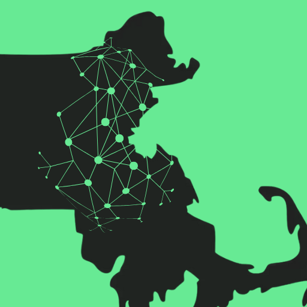

<h1 align="center">Greater Boston Mesh</h1>

  

Greater Boston Mesh is a volunteer-led community building resilient, off-grid communications across the Greater Boston area.

We support and document practical mesh networking workflows, including:
- **MeshCore**
- **Meshtastic**

## Website

- Main site: https://bostonme.sh/

## Documentation

- Docs home: https://bostonme.sh/docs/Introduction
- MeshCore docs: https://bostonme.sh/docs/MeshCore
- Meshtastic docs: https://bostonme.sh/docs/Meshtastic

## Contributing

- Contributing docs: https://bostonme.sh/docs/contributing-docs

## Run Locally

- Local development notes: [LOCAL_DEVELOPMENT.md](./LOCAL_DEVELOPMENT.md)
