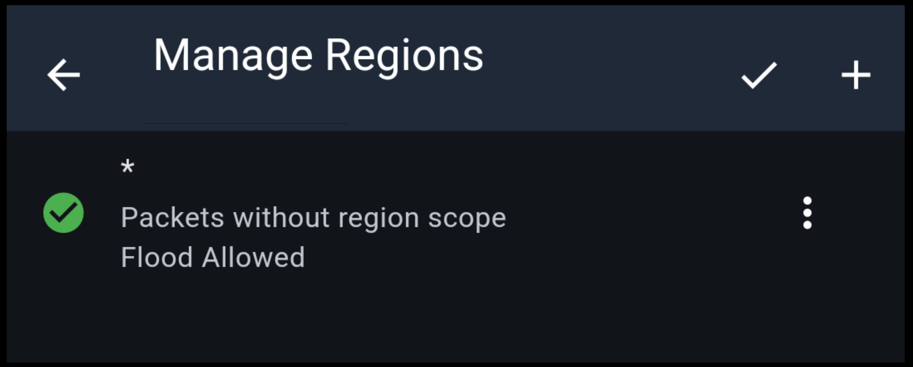
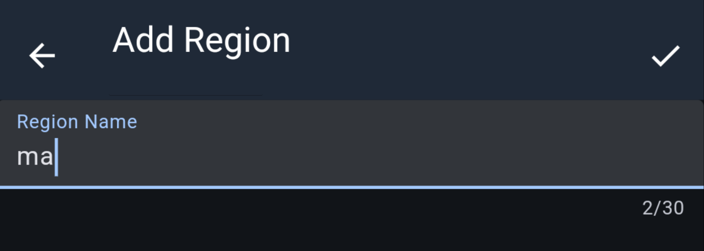
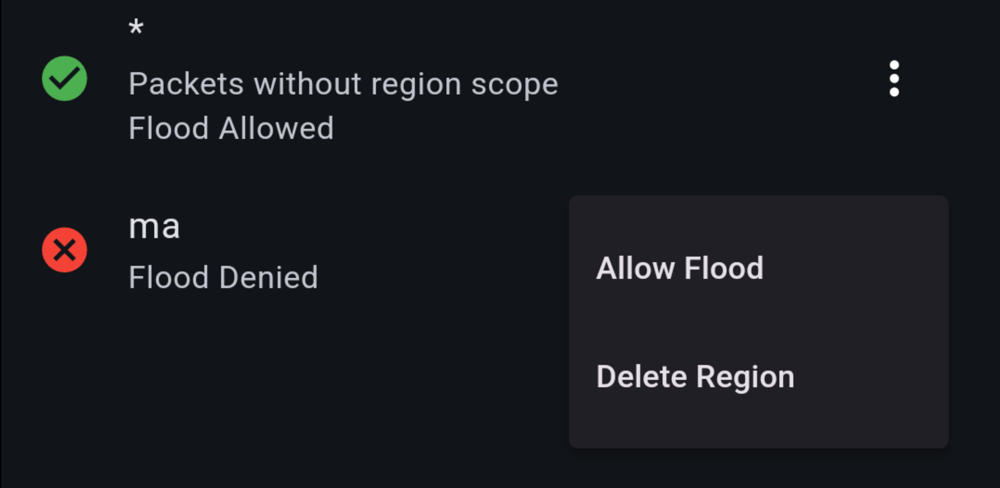
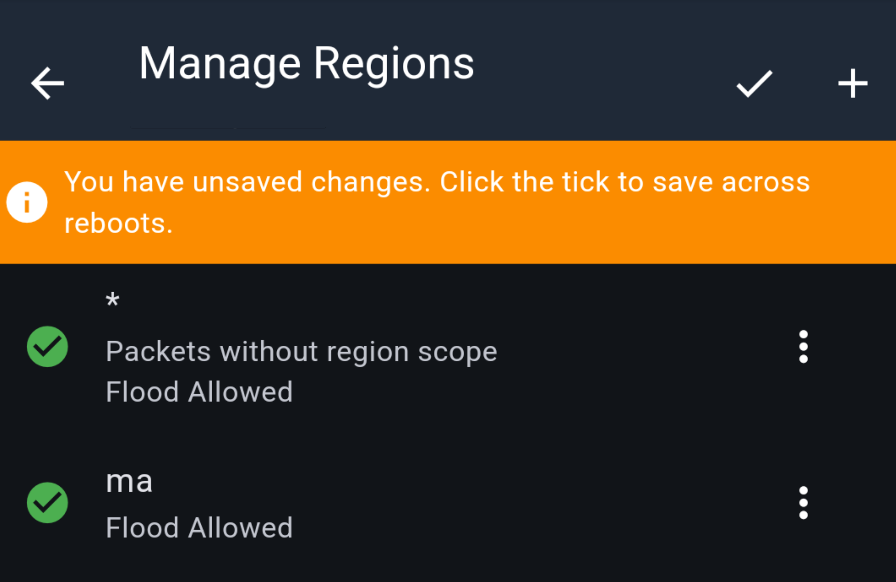

# MeshCore Regions for Repeaters

Region management is for **repeater deployments**.  
When you deploy a repeater, set the repeater region using the state code for where it is physically installed.

Using consistent state-based regions helps with:

- Keeping flood behavior predictable
- Making repeater intent clear to other operators
- Coordinating regional deployment decisions

## State region codes

Use these region names for Greater Boston Mesh deployments:

- `ma` (Massachusetts)
- `me` (Maine)
- `ri` (Rhode Island)
- `vt` (Vermont)
- `nh` (New Hampshire)
- `ct` (Connecticut)

If you are unsure which region to use, ask in Discord or Public mesh chat before finalizing deployment.

## Rollout note for flood permissions

Do not deny flood on `*` yet.

We need all deployed repeaters on compatible versions before changing global flood behavior, and that upgrade process may take time as nodes are updated across different locations.

We can start adding and organizing regions now, then apply stricter flood-permission behavior once the network is fully updated.

These settings can be changed remotely over the mesh after a repeater is deployed.

## How to set region in the UI

1. Open the MeshCore app.
2. Connect to your companion.
3. Log into the repeater as admin.
4. Go to `Settings`.
5. Select `Manage Regions`.
   
6. Click the add button at the top right.
   
7. Enter in `ma` and click the check mark at the top right.
   
8. Click the 3 dots next to `ma` and select `Allow Flood`.
9. Click the check box to confirm region settings.
   

## How to set `ma` as an allowed region (CLI)

Use this sequence on a repeater serial CLI to create/update `ma`, allow flood, and persist it.

```bash
region put ma *
```
Creates (or updates) the `ma` region under global scope.

```bash
region allowf ma
```
Enables flood permission for `ma`.

```bash
region save
```
Saves region definitions and permissions to storage.

Optional verification:

```bash
region get ma
```
Checks the `ma` region entry.

```bash
region list allowed
```
Confirms `ma` appears in the allowed list.

For the full region command list, see the official MeshCore CLI reference:
https://github.com/meshcore-dev/MeshCore/wiki/Repeater-&-Room-Server-CLI-Reference#region-management-repeater-only
