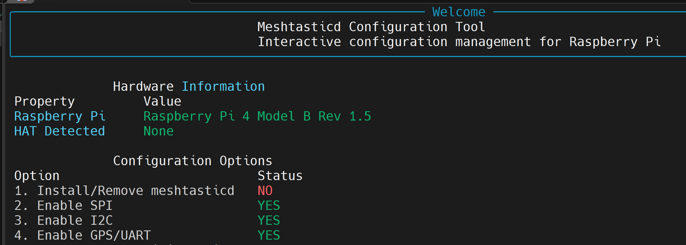

# MeshCore - Raspberry Pi 1W Repeater

This document outlines the bill of materials (BOM) and setup for a MeshCore repeater using a Raspberry Pi and a MeshADV board or similar SX1262 radio. *(Only tested with MeshADV.)*

---

## 📋 Bill of Materials

| Item | Qty | Price (USD) | Link | Notes |
|------|-----|-------------|------|-------|
| Antenna | 1 | $30 | [Amazon](https://www.amazon.com/dp/B0CWN7VHP3) | 5.8 dBi antenna. Any antenna with an N-Type male connector will work. |
| U.FL to N-Type Female | 1 | $9 | [Amazon](https://www.amazon.com/dp/B0C8M77ZMW) | Connects the MeshADV to the antenna. |
| ATGM336H GPS+BDS | 1 | $20 | [Amazon](https://www.amazon.com/dp/B09LQDG1HY) | Optional, if you want to make an NTP server as well. |
| MeshAdv Pi Hat v1.1 | 1 | $? | [Etsy](https://www.etsy.com/listing/1849074257/meshadv-pi-hat-v11-fully-assembled-1) | Currently sold out at time of writing. PCB is available on [GitHub](https://github.com/chrismyers2000/MeshAdv-Pi-Hat/tree/main/V1.1/IPEX/PCB) to order through [JLCPCB](https://jlcpcb.com/). |
| Raspberry Pi 4B – 2GB | 1 | $45 | [PiShop](https://www.pishop.us/product/raspberry-pi-4-model-b-2gb/) | 2GB is more than enough for MeshCore and leaves resources for other services. |
| 32GB MicroSD Card | 1 | $14 | [Amazon](https://www.amazon.com/dp/B084CJLNM4) | Max Endurance MicroSD recommended for long runtime. |
| WaveShare PoE Hat | 1 | $25 | [Amazon](https://www.amazon.com/dp/B0928ZD7QQ) | Optional PoE hat with GPIO passthrough. Note: the fan on these models tends to fail — alternative hats recommended for long-term builds. |
| USB-C PoE Splitter | 1 | $15 | [Amazon](https://www.amazon.com/dp/B087F4QCTR?th=1) | Optional PoE splitter instead of a PoE hat. |
| Outdoor-rated project box | 1 | N/A | N/A | A box large enough to fit the Pi and two GPIO hats installed. |

---

## 🛠️ Explanation

The main use-case of this node is for building a static home base or remote deployment where you have internet access via Ethernet to the Pi. This allows you to update the node remotely without needing USB/Wi-Fi/Bluetooth for updates.

This document assumes the user has fundamental knowledge of using a Linux OS.

---

## ⚡ Hardware Build Instructions

## ⚡ Software Build Instructions

- Image the MicroSD card using [Raspberry Pi Imager](https://www.raspberrypi.com/software/) with **Raspberry Pi OS Lite (64-bit)**. Configure custom settings such as hostname, location, and user login. *(Set up Wi-Fi if you plan to use it instead of Ethernet.)*
- Insert the MicroSD card into the Pi and power it up.
- Once the Pi boots, locate it on your network and SSH into it with the credentials you set in the Imager.
- Update the Pi using:  
```
sudo apt update && sudo apt upgrade -y
```
 - Next, we need to make sure the dependisies are installed.
```
sudo apt install git bc -y
```
- Next, install the configuration for the MeshADV board. We will use the  
  [Meshtasticd-Configuration-Tool](https://github.com/chrismyers2000/Meshtasticd-Configuration-Tool) for easier setup of the required changes for MeshADV.
- Download and run the script `meshtasticd_config_tool_CLI.py`, following instructions on the GitHub page.
- In the Configuration Tool, run options **2, 3, and 4**.



- Reboot the Pi after closing the configuration tool, then log back in via SSH.
- Next we need to clone the GitHub [pyMC_Repeater](https://github.com/rightup/pyMC_Repeater)
```
git clone https://github.com/rightup/pyMC_Repeater.git
cd pyMC_Repeater
```
- Next we need to install the repeater software.
```
sudo bash deploy.sh
```

