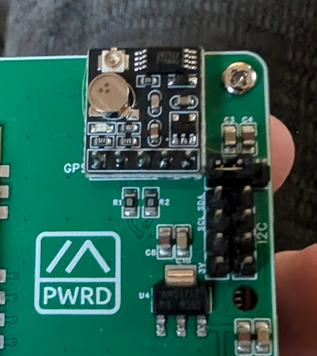
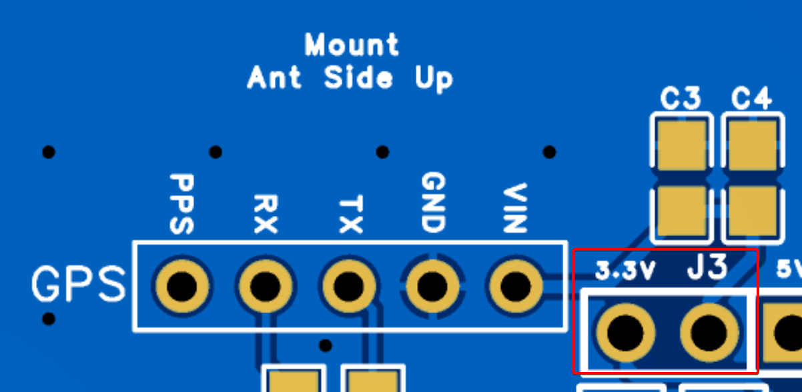
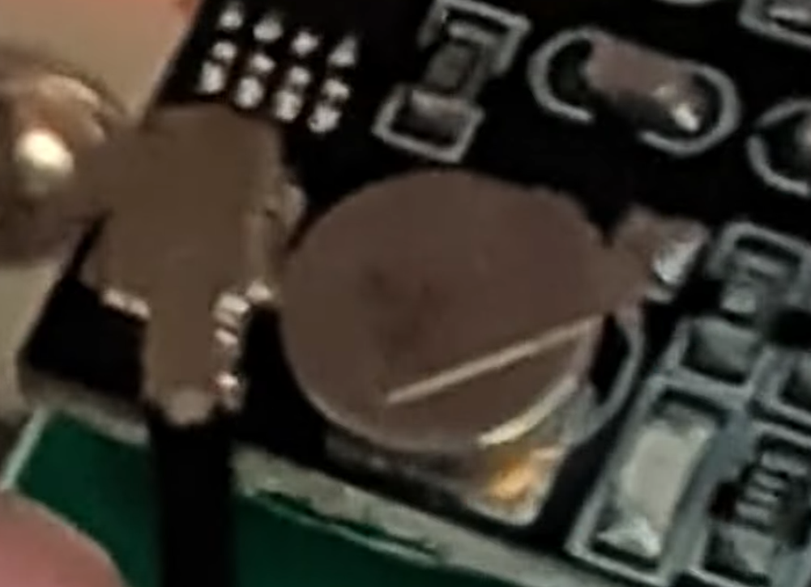
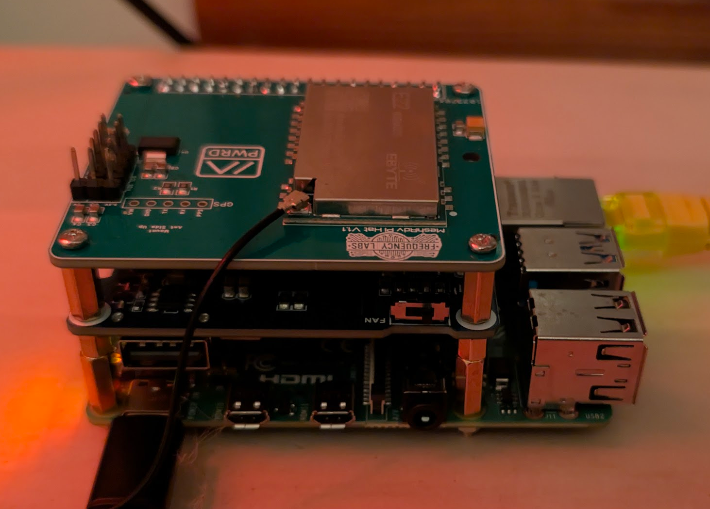
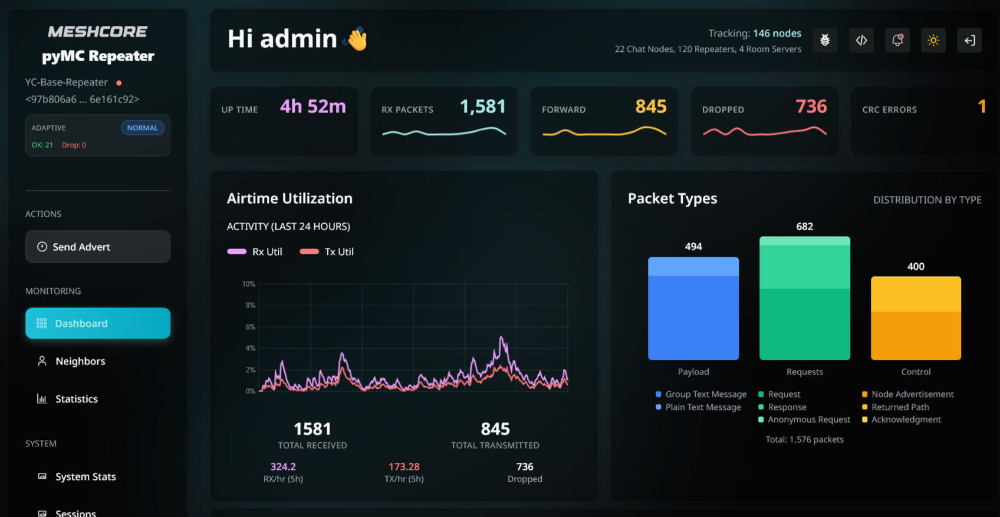

# MeshCore Raspberry Pi 1W Repeater

This document outlines the bill of materials (BOM) and setup for a MeshCore repeater using a Raspberry Pi and a MeshADV board or similar SX1262 radio. **Tested with MeshADV and PiMesh-1W v1**

For setup instructions for the **PiMesh-1W v2**, follow the guide provided on [MeshSmith’s site](https://meshsmith.net/products/pimesh-1w).

---

## 📋 Bill of Materials

| Item | Qty | Price (USD) | Link | Notes |
|------|-----|-------------|------|-------|
| Antenna | 1 | $30 | [Amazon](https://www.amazon.com/dp/B0CWN7VHP3) | 5.8 dBi antenna. Any antenna with an N-Type male connector will work. |
| U.FL to N-Type Female | 1 | $9 | [Amazon](https://www.amazon.com/dp/B0C8M77ZMW) | Connects the MeshADV to the antenna. |
| ATGM336H GPS+BDS | 1 | $20 | [Amazon](https://www.amazon.com/dp/B09LQDG1HY) | Optional, if you want to build an NTP server as well. |
| MeshAdv Pi Hat v1.1 | 1 | $? | [Etsy](https://www.etsy.com/listing/1849074257/meshadv-pi-hat-v11-fully-assembled-1) | Currently sold out at the time of writing. PCB is available on [GitHub](https://github.com/chrismyers2000/MeshAdv-Pi-Hat/tree/main/V1.1/IPEX/PCB) to order through [JLCPCB](https://jlcpcb.com/). |
| PiMesh-1W | 1 | $65-$105 | [MeshSmith](https://meshsmith.net/) | Replacement to MeshADV. Made by a local CT Dev. |
| Raspberry Pi 4B – 2GB | 1 | $45 | [PiShop](https://www.pishop.us/product/raspberry-pi-4-model-b-2gb/) | 2GB is more than enough for MeshCore and leaves resources for other services. |
| 32GB MicroSD Card | 1 | $14 | [Amazon](https://www.amazon.com/dp/B084CJLNM4) | Max Endurance MicroSD recommended for long runtime. |
| WaveShare PoE Hat | 1 | $25 | [Amazon](https://www.amazon.com/dp/B0928ZD7QQ) | Optional PoE hat with GPIO passthrough. Note: the fan on these models tends to fail — alternative hats recommended for long-term builds. |
| USB-C PoE Splitter | 1 | $15 | [Amazon](https://www.amazon.com/dp/B087F4QCTR) | Optional PoE splitter instead of a PoE hat. |
| Brass Spacer/Standoffs + Nuts + Screws | 1 | $10 | [Amazon](https://www.amazon.com/dp/B0756CW6Y2) | Standoffs and spacers. |
| Outdoor-rated project box | 1 | N/A | N/A | A box large enough to fit the Pi and two GPIO hats installed. |

---

## 🛠️ Explanation

The main use case of this node is for building a static home base or remote deployment where you have internet access via Ethernet to the Pi. This allows you to update the node remotely without needing USB, Wi-Fi, or Bluetooth.

This document assumes the user has fundamental knowledge of using a Linux OS.

This document includes instructions for adding the GPS module, but does **not** provide guidance on building a stratum-1 NTP server.

---

## ⚡ Hardware Build Instructions

<mark>**NOTE:** NEVER POWER ON THE MESHADV WITHOUT AN ANTENNA CONNECTED!</mark>  
Doing so can (and likely will) burn out the SX1262 radio.

We will be using the WaveShare PoE hat in this build. You can also use a USB-C PoE splitter instead.

- OPTIONAL: Solder the GPS module to the MeshADV board. The recommended module is the ATGM336H listed in the BOM.  


- Once soldered, jumper the `3.3v` and `J3` pins on the board to power the GPS module.  


- Be careful that the GPS antenna does not short against the backup battery soldered onto the GPS module.  


- Install the PoE hat and MeshADV, starting with the PoE hat and then stacking the MeshADV on top.  


- Connect the desired antenna.
- Power up the Pi by plugging in an Ethernet cable with PoE. You can use a PoE injector or a PoE-capable network switch.

---

## 🚀 Software Build Instructions

- Image the MicroSD card using [Raspberry Pi Imager](https://www.raspberrypi.com/software/) with **Raspberry Pi OS Lite (64-bit)**. Configure custom settings such as hostname, location, and user login. *(Enable Wi-Fi if needed.)*

- Insert the MicroSD card into the Pi and power it up.

- Once the Pi boots, locate it on your network and SSH into it using the credentials you set.

- Update the Pi:
```
sudo apt update && sudo apt upgrade -y
```

- Install dependencies:
```
sudo apt install git bc -y
```

---

Next, we need to enable: `SPI`, `I²C`, and `UART`.

We need to edit the `/boot/firmware/config.txt` file:

```
sudo nano /boot/firmware/config.txt
```

Add the following to the bottom of the file:

```
# Enable SPI
dtparam=spi=on
dtoverlay=spi0-0cs # Do NOT include this for PiMesh-1W v2!

# Enable I2C
dtparam=i2c_arm=on

# Enable UART (For all Pi versions except Pi 5)
enable_uart=1
```

Note: If doing this on a Pi 5, use this entry for UART instead:

```
dtoverlay=uart0
```

---

Clone the [pyMC_Repeater](https://github.com/rightup/pyMC_Repeater) repository:

```
git clone https://github.com/rightup/pyMC_Repeater.git
```

Install the repeater software:

```
cd pyMC_Repeater && sudo bash manage.sh install
```
- The installer will install all required packages and dependencies for pyMC.

After the installation finishes, the script will prompt you to open a web browser and continue setup at:
`http://<your-pis-ip-address>:8000`  




---

## ⚙️ pyMC Repeater Configuration

To change the configuration of the repeater, edit the `config.yaml` file.

Using nano, edit the file located at:

```
sudo nano /etc/pymc_repeater/config.yaml
```

After making changes, restart the service. This can be done using the `manage.sh` script:
```
sudo bash manage.sh restart
```

Or via systemctl:

```
sudo systemctl restart pymc-repeater.service
```
